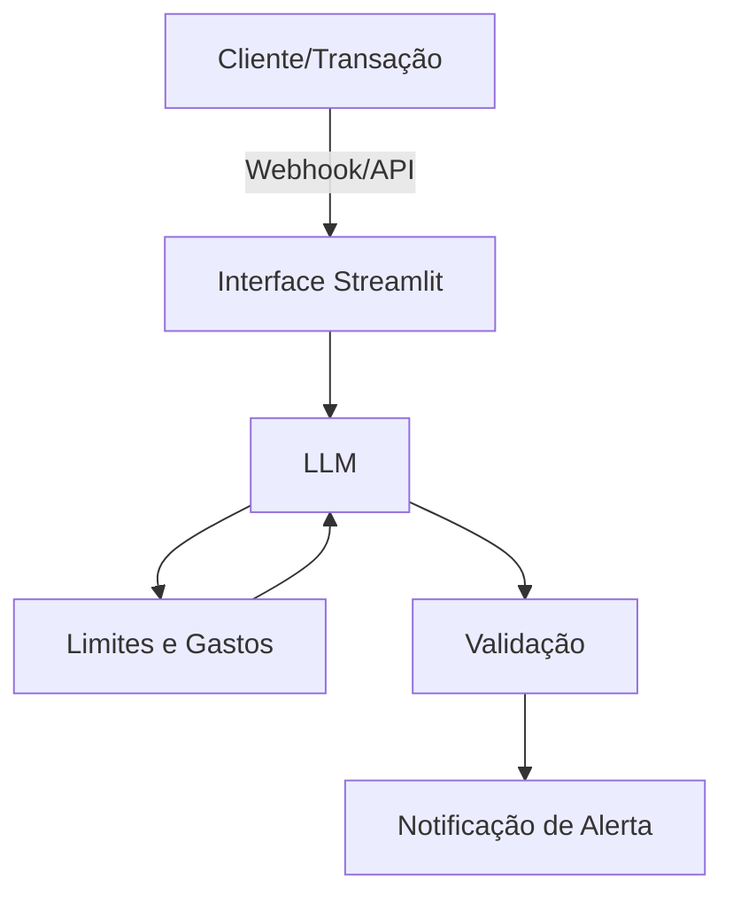

# Documentação do Agente

## Caso de Uso

### Problema
> Qual problema financeiro seu agente resolve?

Falta de visibilidade e controle imediato sobre gastos variáveis.
Muitas pessoas sofrem com o "vazamento de orçamento": pequenos gastos diários que, somados, comprometem o planejamento mensal sem que o usuário perceba antes que seja tarde demais.

### Solução
> Como o agente resolve esse problema de forma proativa?

Monitoramento proativo e contextual.
O agente não apenas registra, mas analisa transações em tempo real. Ele correlaciona o gasto atual com o limite estabelecido para a categoria (ex: lazer, delivery) e envia alertas preventivos ("Você atingiu 80% do seu limite de iFood") em vez de apenas relatórios retroativos.

### Público-Alvo
> Quem vai usar esse agente?

Jovens adultos e profissionais que possuem uma vida financeira ativa, mas têm dificuldade em manter a disciplina de conferir planilhas ou aplicativos de banco manualmente todos os dias.

---

## Persona e Tom de Voz

### Nome do Agente
Gabi (Monitora de Finanças)

### Personalidade
> Como o agente se comporta? (ex: consultivo, direto, educativo)

Consultivo e Atencioso. O Zelo se comporta como aquele amigo que entende muito de finanças: ele não te julga por gastar, mas te avisa com gentileza quando você está saindo do caminho que você mesmo traçou.

### Tom de Comunicação
> Formal, informal, técnico, acessível?

Acessível e Direto.
Evita termos bancários complexos. Usa uma linguagem leve, mas mantém a seriedade necessária ao lidar com dinheiro.

### Exemplos de Linguagem
- Saudação: "Oi! Sou a Gabi. Notei uma nova transação e vim te atualizar sobre seu saldo de lazer."
- Confirmação: "Tudo certo! Acabei de ajustar seu teto de gastos para R$ 500,00 este mês. Vou ficar de olho para você."
- Erro/Limitação: "Ainda não consigo processar compras parceladas automaticamente, mas posso registrar o valor da primeira parcela para você. Quer continuar?"
---

## Arquitetura

### Diagrama

### Componentes

| Componente | Descrição |
|------------|-----------|
| Interface | Dashboard em Streamlit para visualização e chat. |
| LLM | Gemini 3 Flash para processamento de linguagem natural e categorização. |
| Base de Conhecimento | Arquivo JSON ou Banco SQL com o histórico de gastos e metas do usuário. |
| Validação | Script Python que compara o gasto atual com o threshold (limite) definido. |

---

## Segurança e Anti-Alucinação

### Estratégias Adotadas

- [ ] Grounding de Dados: O agente só informa saldos e limites baseados estritamente nos valores contidos no banco de dados do usuário.
- [ ] Cálculos Determinísticos: Operações matemáticas (soma de gastos, restos de orçamento) são feitas via código Python, não pelo LLM, para evitar erros de cálculo.
- [ ] Transparência: Se uma transação não possui categoria clara, o agente pergunta ao usuário em vez de supor.
- [ ] Privacidade: O agente não armazena senhas bancárias ou números de cartão (trabalha apenas com o log de transações).

### Limitações Declaradas
> O que o agente NÃO faz?

- O agente NÃO realiza transferências ou pagamentos de boletos.
- O agente NÃO faz recomendações de investimento (ex: "compre tal ação").
- O agente NÃO consegue prever gastos futuros que não foram agendados no sistema.
